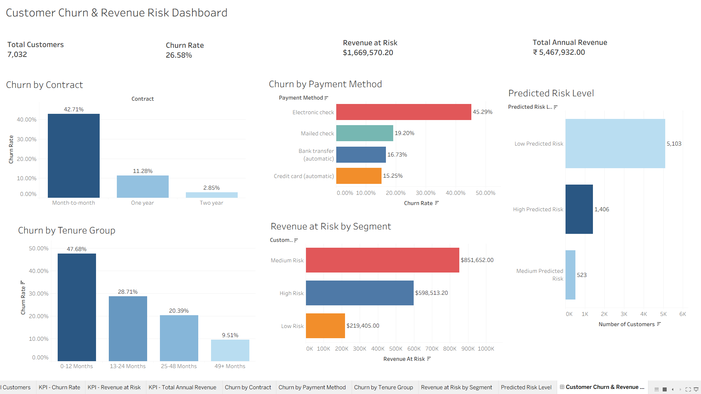

# Customer Churn Analytics, Revenue Risk & Retention Optimization

## Project Overview

This project analyzes customer churn for a telecom company using Python, SQL, Tableau, and machine learning.

The main goal of this project is to understand why customers leave, identify customer groups with higher churn risk, estimate annual revenue at risk, and recommend actions that can help improve customer retention.

This is an end-to-end data analytics portfolio project. It includes data cleaning, exploratory data analysis, SQL business queries, feature engineering, machine learning, Tableau dashboarding, business recommendations, and an executive-style presentation.

---

## Business Problem

Customer churn is a major business problem because when customers leave, the company loses recurring revenue and future customer value.

The business wants to understand:

- What is the overall churn rate?
- Which customers are more likely to churn?
- Which contract types have the highest churn?
- Which payment methods are linked to higher churn?
- Are newer customers more likely to leave?
- How much estimated annual revenue is at risk?
- Which customers should be prioritized for retention campaigns?
- How can machine learning support proactive retention?

This project answers these questions using data analysis, SQL, visualization, and machine learning.

---

## Tools and Technologies Used

- Python
- Pandas
- NumPy
- Matplotlib
- Scikit-learn
- SQL Server
- Tableau Public
- Jupyter Notebook
- PowerPoint
- GitHub

---

## Dataset

This project uses the Telco Customer Churn dataset.

The dataset contains customer information such as:

- Customer ID
- Gender
- Senior Citizen
- Partner
- Dependents
- Tenure
- Phone Service
- Internet Service
- Contract Type
- Payment Method
- Monthly Charges
- Total Charges
- Churn Status

Each row represents one customer, and each column represents customer information.

---

## Project Workflow

### 1. Data Cleaning with Python

The raw dataset was cleaned using Python and Pandas.

Main cleaning steps included:

- Loaded the raw CSV file
- Checked dataset size, column names, and data types
- Checked missing values
- Checked duplicate rows
- Converted `TotalCharges` from text to numeric
- Removed rows with missing `TotalCharges`
- Reset the dataset index after cleaning
- Saved the cleaned dataset for SQL and Tableau

Cleaned dataset:

```text
data/cleaned/cleaned_customer_churn.csv
```

---

### 2. Feature Engineering

New business-focused columns were created to make the analysis stronger.

Created columns:

- `ChurnFlag`
- `EstimatedAnnualRevenue`
- `TenureGroup`
- `RevenueAtRisk`
- `CustomerRiskSegment`
- `ChurnProbability`
- `PredictedRiskLevel`

These columns helped turn the dataset into a business-ready churn and revenue-risk analysis file.

For example:

- `ChurnFlag` converts churn into 1 or 0
- `EstimatedAnnualRevenue` estimates yearly revenue from monthly charges
- `RevenueAtRisk` estimates revenue connected to churned customers
- `CustomerRiskSegment` groups customers into risk categories
- `ChurnProbability` gives each customer a predicted churn score

---

### 3. Exploratory Data Analysis

Exploratory data analysis was completed in Python to understand customer churn patterns.

The analysis focused on:

- Overall churn rate
- Churn by contract type
- Churn by payment method
- Churn by tenure group
- Revenue at risk
- Customer risk segments

This helped identify which customer groups are more likely to leave and where the business should focus retention efforts.

---

### 4. SQL Business Analysis

SQL Server was used to write business-focused queries.

The SQL analysis included:

- Viewing sample data
- Counting total customers
- Counting churned and non-churned customers
- Calculating overall churn rate
- Analyzing churn by contract type
- Analyzing churn by payment method
- Analyzing churn by tenure group
- Calculating total estimated annual revenue
- Calculating total revenue at risk
- Analyzing churn by customer risk segment
- Finding high-value churned customers
- Finding retention priority customers

SQL file:

```text
sql/churn_business_queries.sql
```

---

### 5. Machine Learning Model

A Random Forest machine learning model was built to predict customer churn.

The machine learning process included:

- Created a copy of the cleaned dataset
- Removed customer ID from model features
- Separated input features and target variable
- Converted text columns into numeric columns
- Split the dataset into training and testing data
- Trained a Random Forest model
- Evaluated the model using accuracy and classification report
- Reviewed feature importance
- Created churn probability scores for customers

Final prediction dataset:

```text
data/cleaned/customer_churn_with_predictions.csv
```

This file includes the final prediction columns:

- `ChurnProbability`
- `PredictedRiskLevel`

These columns help identify customers who may be more likely to leave in the future.

---

## Tableau Dashboard

An interactive Tableau dashboard was created to show churn performance, revenue risk, and customer risk segments.

Dashboard includes:

- Total Customers
- Overall Churn Rate
- Total Revenue at Risk
- Total Estimated Annual Revenue
- Churn by Contract Type
- Churn by Payment Method
- Churn by Tenure Group
- Revenue at Risk by Customer Segment
- Predicted Risk Level

### Tableau Dashboard Link

[View Tableau Dashboard](https://public.tableau.com/views/CustomerChurnDashboard_twbx/CustomerChurnRevenueRiskDashboard?:language=en-US&publish=yes&:sid=&:redirect=auth&:display_count=n&:origin=viz_share_link)

---

## Dashboard Preview



---

## Presentation

An executive-style PowerPoint presentation was created to summarize the project for business and recruiter audiences.

The presentation covers:

- Business problem
- Dataset overview
- Tools used
- Data cleaning process
- Key churn insights
- Revenue at risk
- Machine learning approach
- Tableau dashboard summary
- Business recommendations
- Final project impact

Presentation file:

```text
presentation/customer_churn_retention_analysis_presentation.pptx
```

---

## Key Metrics

|         Metric                 |     Result    |
|                                |               |
|       Total Customers          |      7,032    |
|       Overall Churn Rate       |     26.58%    |
|       Revenue at Risk          | $1,669,570.20 |
| Total Estimated Annual Revenue | $5,467,932.00 |

---

## Key Insights

### 1. Overall Churn Rate

The overall churn rate is approximately **26.58%**.

This means about 27 out of every 100 customers left the company.

---

### 2. Month-to-Month Customers Have the Highest Churn

Customers with month-to-month contracts have the highest churn rate.

In the Tableau dashboard, month-to-month customers show a churn rate of about **42.71%**.

This shows that customers without a long-term contract are more likely to leave.

---

### 3. Electronic Check Customers Have Higher Churn

Customers using electronic check have higher churn compared to other payment methods.

The dashboard shows electronic check customers have a churn rate of about **45.29%**.

This may show payment friction or lower customer commitment.

---

### 4. New Customers Are More Likely to Leave

Customers with lower tenure have higher churn.

The 0-12 month tenure group has the highest churn rate at about **47.6%**.

This means the company should pay more attention to customers during the first year.

---

### 5. Churn Creates Revenue Risk

Churn is not only a customer count problem. It is also a revenue problem.

The revenue-at-risk analysis estimates that about **$1.67M** in annual revenue is connected to churned customers.

---

### 6. Machine Learning Can Support Proactive Retention

The machine learning model gives each customer a churn probability score.

This helps the business identify customers who may leave before they actually churn.

The final dataset includes predicted risk groups such as:

- Low Predicted Risk
- Medium Predicted Risk
- High Predicted Risk

---

## Business Recommendations

### 1. Target Month-to-Month Customers

Month-to-month customers have the highest churn rate.

The company should encourage these customers to move into one-year or two-year contracts by offering:

- Discounts
- Loyalty rewards
- Bundled service packages
- Contract upgrade offers

---

### 2. Improve New Customer Onboarding

Newer customers are more likely to churn.

The company should improve the first 12 months of the customer journey by offering:

- Better onboarding
- Welcome offers
- Early support
- Customer satisfaction check-ins
- Loyalty programs for new customers

---

### 3. Reduce Payment Friction

Customers using electronic check have higher churn.

The company should encourage customers to switch to automatic payment methods such as:

- Credit card
- Bank transfer
- Automatic monthly payment

This may help improve retention.

---

### 4. Prioritize High-Value Customers at Risk

Customers with high monthly charges and high churn probability should be prioritized.

The company should use these customers for:

- Proactive outreach
- Personalized offers
- Support follow-ups
- Retention campaigns

---

### 5. Use Churn Probability for Retention Planning

The machine learning model provides a churn probability score for each customer.

The business can use this score to:

- Identify high-risk customers
- Contact customers before they leave
- Prioritize retention campaigns
- Combine churn risk with revenue risk

---

## Project Folder Structure

```text
customer-churn-prediction-retention-analysis/
│
├── data/
│   ├── raw/
│   │   └── Telco-Customer-Churn.csv
│   └── cleaned/
│       ├── cleaned_customer_churn.csv
│       └── customer_churn_with_predictions.csv
│
├── notebooks/
│   └── customer_churn_analysis.ipynb
│
├── sql/
│   └── churn_business_queries.sql
│
├── tableau/
│   ├── customer_churn_dashboard.twbx
│   └── tableau_dashboard_link.txt
│
├── images/
│   └── dashboard_screenshot.png
│
├── presentation/
│   └── customer_churn_retention_analysis_presentation.pptx
│
└── README.md
```

---

## Files Included

| File | Description |
|---|---|
| `notebooks/customer_churn_analysis.ipynb` | Main Jupyter Notebook for data cleaning, EDA, feature engineering, and machine learning |
| `data/raw/Telco-Customer-Churn.csv` | Original raw dataset |
| `data/cleaned/cleaned_customer_churn.csv` | Cleaned dataset used for SQL analysis |
| `data/cleaned/customer_churn_with_predictions.csv` | Final dataset with churn probability and predicted risk level |
| `sql/churn_business_queries.sql` | SQL queries for churn, revenue, and retention analysis |
| `tableau/customer_churn_dashboard.twbx` | Tableau workbook |
| `tableau/tableau_dashboard_link.txt` | Tableau Public dashboard link |
| `images/dashboard_screenshot.png` | Dashboard screenshot |
| `presentation/customer_churn_retention_analysis_presentation.pptx` | Executive-style project presentation |
| `README.md` | Project documentation |

---

## How to Run This Project

### 1. Open the Jupyter Notebook

Open this file:

```text
notebooks/customer_churn_analysis.ipynb
```

Run the notebook cells from top to bottom.

---

### 2. Run SQL Analysis

Import this file into SQL Server:

```text
data/cleaned/cleaned_customer_churn.csv
```

Use this table name:

```text
cleaned_customer_churn
```

Then run the SQL queries from:

```text
sql/churn_business_queries.sql
```

---

### 3. View Tableau Dashboard

Use this file in Tableau:

```text
data/cleaned/customer_churn_with_predictions.csv
```

Or view the published dashboard here:

[View Tableau Dashboard](https://public.tableau.com/views/CustomerChurnDashboard_twbx/CustomerChurnRevenueRiskDashboard?:language=en-US&publish=yes&:sid=&:redirect=auth&:display_count=n&:origin=viz_share_link)

---

### 4. Review Presentation

Open this file:

```text
presentation/customer_churn_retention_analysis_presentation.pptx
```

This presentation summarizes the full project in a business-friendly format.

---

## Business Value

This project helps a business:

- Understand why customers churn
- Identify high-risk customer groups
- Estimate annual revenue at risk
- Prioritize retention campaigns
- Use machine learning to predict customer churn
- Build a dashboard for business decision-making
- Present insights in an executive-friendly format

---

## Skills Demonstrated

This project demonstrates the following skills:

- Data cleaning with Python and Pandas
- Exploratory data analysis
- Feature engineering
- SQL querying and business reporting
- Customer segmentation
- Revenue-risk analysis
- Machine learning classification
- Churn probability scoring
- Tableau dashboard development
- Executive presentation creation
- Business recommendations
- Data storytelling

---

